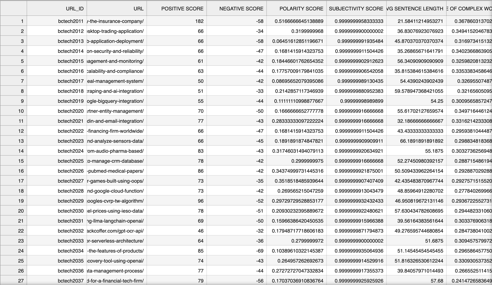

# Text Analysis Project

## Overview
This project performs text analysis on web articles by scraping the content from given URLs and generating a comprehensive report in Excel format. The report includes various attributes calculated based on several factors of the articles using machine learning models.

## Features
- **Web Scraping**: Extracts content from provided web URLs.
- **Text Analysis**: Calculates the following attributes:
  - Positive Score
  - Negative Score
  - Polarity Score
  - Subjectivity Score
  - Average Sentence Length
  - Percentage of Complex Words
  - Fog Index
  - Average Number of Words per Sentence
  - Complex Word Count
  - Word Count
  - Syllables per Word
  - Personal Pronoun Count
  - Average Word Length
- **Machine Learning**: Utilizes XGBoost classifier to identify positive and negative words.

-**Output**:

